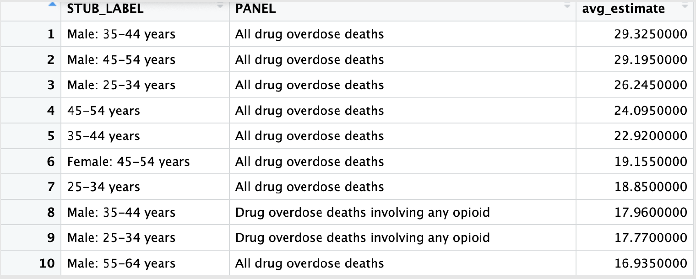
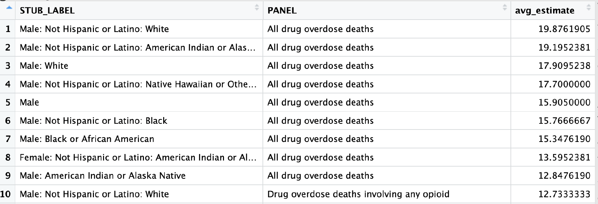
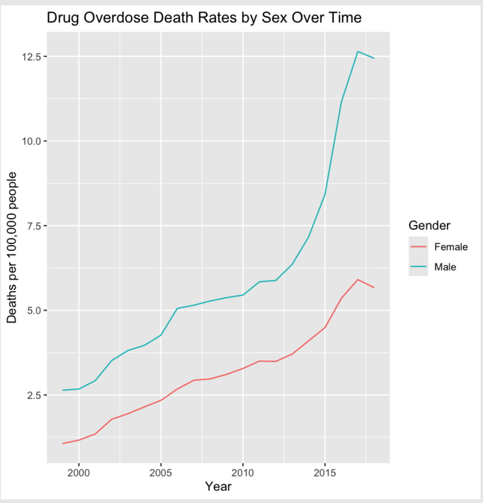
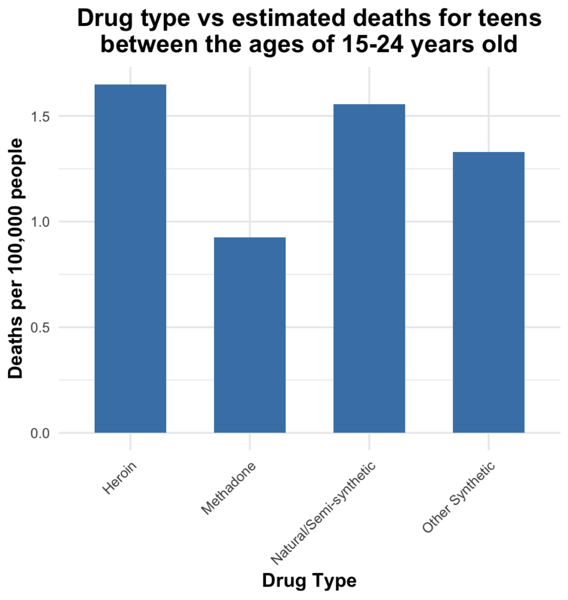
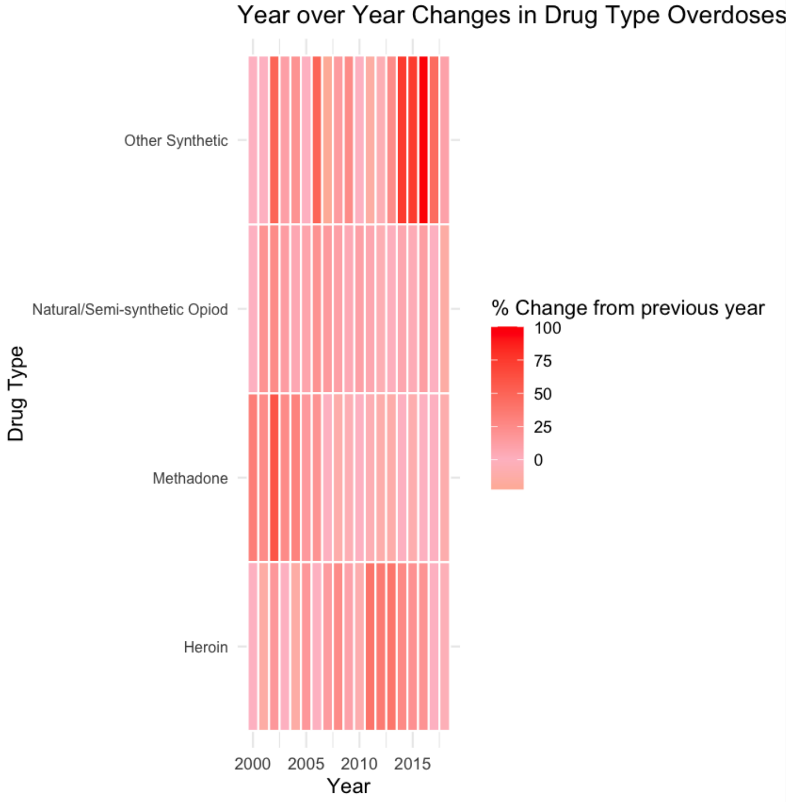

# Drug Overdose Death Rates in the US: A Deep Analysis in R

## Overview
An exploratory data analysis of national drug overdose death rates, examining which population subgroups are most affected, how trends have shifted over time by gender, which drug types drive overdose deaths among young adults, and which years saw the sharpest year over year increases by drug type.

Completed for ALY 6000 (Project 4) at Northeastern University.

## Dataset
NCHS drug overdose death rate data from the CDC, covering deaths per 100,000 resident population broken out by drug type, sex, age, race, and Hispanic origin.

Key columns used:

| Column | Description |
|---|---|
| `INDICATOR` | Drug overdose deaths label |
| `PANEL` | Type of drug associated with the death |
| `UNIT` | Deaths per 100,000 resident population, either age adjusted or crude |
| `STUB_NAME` | Population category description |
| `STUB_LABEL` | Specific population subgroup |
| `YEAR` | Year of observation |
| `AGE` | Age group |
| `ESTIMATE` | Estimated death rate, the primary measure in this analysis |

## Research Questions
1. Which population subgroup experienced the highest average drug overdose death rate, in both age adjusted and crude units?
2. How have drug overdose trends changed over time for different genders?
3. Which drug types do young adults between the ages of 15 and 24 overdose on most?
4. Which year showed the sharpest increase in overdose deaths for different drug types?

## Key Findings

### 1. Males aged 35 to 44 lead in crude rates, while white males lead once age is adjusted for
Filtering to crude units, males aged 35 to 44 had the highest average estimate at 29.3 deaths per 100,000 residents, followed closely by males aged 45 to 54 at 29.2 and males aged 25 to 34 at 26.2. The highest female subgroup, ages 45 to 54, came in at 19.15, roughly 10 points below the comparable male group.

Switching to age adjusted units changes the picture and allows the analysis to resolve down to ethnicity. Non Hispanic white males showed the highest average estimate at 19.9, followed by American Indian or Alaska Native males at 19.2.

### 2. Age adjustment shifts male estimates more than female estimates
Because a subgroup with an older population will show a higher natural death rate regardless of underlying risk, age adjusted rates are necessary to compare true risk across populations fairly.

Grouping by sex and comparing the two unit types directly, age adjusted estimates came in slightly below crude estimates for both groups. The gap was negligible for females at roughly 0.004, but five times larger for males at roughly 0.020. A small difference, but a useful caveat to carry into the rest of the analysis.

### 3. Overdose death rates have risen steadily since 2000, with a sharp acceleration after 2012
Averaging estimates by gender per year shows males consistently above females across the entire period. Both groups show a marked acceleration starting around 2012, with male rates climbing from roughly 6 to above 12.5 deaths per 100,000 by the end of the series. Neither trend shows signs of slowing.

### 4. Heroin leads overdose deaths among people aged 15 to 24
Filtering to the 15 to 24 age group and comparing specific drug panels, heroin was the leading drug type at roughly 1.65 deaths per 100,000, followed by natural and semisynthetic opioids at roughly 1.55 and other synthetic opioids at roughly 1.33. Methadone was lowest at roughly 0.93.

While these absolute figures sit below 2 deaths per 100,000, the steep upward trend in overall overdose deaths over the past decade suggests more recent deaths in this age group may be driven increasingly by other synthetic opioids rather than heroin.

### 5. Other synthetic opioids nearly doubled year over year from 2013 to 2015
Computing year over year percent change by drug type and visualizing it as a heatmap, other synthetic opioids showed increases approaching 100 percent from the prior year across 2013 through 2015, meaning overdose deaths from that category roughly doubled annually during that window. Methadone by contrast showed a sharp spike over 75 percent around 2003 before slowing considerably after 2010.

## Conclusion
Drug overdose deaths have risen continuously with no clear sign of slowing. Heroin and other synthetic opioids emerge as the primary drivers, and males show consistently higher estimated death rates than females, with white males and American Indian or Alaska Native populations affected most.

Potential follow up questions: how has availability of these drugs expanded across age groups over time, and through what channels are individuals obtaining them?

## Methods and Tools
Analysis performed in **R** using `tidyverse`, `dplyr`, and `ggplot2`.

Techniques applied:
- Grouped aggregation with `group_by()` and `summarise()` to compute average estimates across subgroups
- Reshaping with `pivot_wider()` to compare crude against age adjusted units side by side
- Lag based year over year change calculation using `lag()` to derive absolute and percent change
- Label recoding with `case_when()` to shorten verbose drug panel names for readable axis labels
- Visualization with `geom_line()` for time series, `geom_col()` for categorical comparison, and `geom_tile()` with a diverging color gradient for the year over year heatmap

## Reference
NCHS. "Drug Overdose Death Rates, by Drug Type, Sex, Age, Race, and Hispanic Origin: United States." Centers for Disease Control and Prevention, 21 Apr. 2025. https://data.cdc.gov/National-Center-for-Health-Statistics/Drug-overdose-death-rates-by-drug-type-sex-age-rac/95ax-ymtc/data_preview
